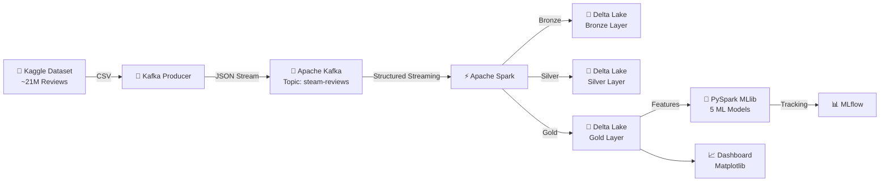

# Steam Reviews Big Data Pipeline

## Proje Özeti

Bu proje, Steam platformundaki ~21 milyon kullanıcı yorumunu gerçek zamanlı olarak işleyen, sentiment analizi yapan ve sonuçları görselleştiren uçtan uca bir büyük veri pipeline'ıdır. Apache Kafka ile stream ingestion, PySpark ile dağıtık işleme, Delta Lake ile katmanlı depolama (Medallion Architecture) ve MLflow ile model yönetimi sağlanmaktadır.

## Mimari



## Teknoloji Stack

| Teknoloji | Versiyon | Kullanım Amacı |
|-----------|----------|----------------|
| Docker & Docker Compose | 3.8 | Konteynerizasyon ve orkestrasyon |
| Apache Kafka | 7.4.0 (Confluent) | Gerçek zamanlı veri akışı |
| Apache Spark | 3.4.0 | Dağıtık veri işleme |
| Delta Lake | 2.4.0 | ACID uyumlu veri gölü |
| MLflow | 2.9.2 | Tracking server + model registry |
| Jupyter Lab | 4.0.x | Notebook ortamı (Spark client) |
| PySpark MLlib | 3.4.0 | Makine öğrenmesi modelleri |

### Servis URL'leri

| Servis | URL |
|--------|-----|
| Spark Master UI | http://localhost:8080 |
| MLflow Tracking | http://localhost:5000 |
| Jupyter Lab | http://localhost:8888 |
| Kafka (host) | localhost:9092 |

## Kurulum

### Gereksinimler
- Docker & Docker Compose
- Python 3.10+
- Kaggle API (veri seti indirmek için)

### Adımlar

```bash
# 1. Repo'yu klonla
git clone https://github.com/<username>/steam-reviews-bigdata.git
cd steam-reviews-bigdata

# 2. Veri setini indir (Kaggle API gerekli)
# https://www.kaggle.com/datasets/andrewmvd/steam-reviews
kaggle datasets download andrewmvd/steam-reviews
unzip steam-reviews.zip -d data/

# 3. Docker container'ları başlat
docker-compose up -d

# 4. Servislerin hazır olmasını bekle (~30 sn)
docker-compose ps

# 5. Producer'ı çalıştır (Kafka'ya veri gönderir)
docker-compose exec producer python producer.py
```

## Proje Yapısı

```
steam-reviews-bigdata/
├── data/
│   └── steam_reviews.csv          # Kaggle'dan indirilen ham veri (~21M satır)
├── producer/
│   ├── Dockerfile                 # Python producer container
│   ├── producer.py                # Kafka producer (CSV → JSON stream)
│   └── requirements.txt           # kafka-python, pandas
├── spark/
│   ├── Dockerfile                 # Spark + Delta + MLflow + Jupyter container
│   └── requirements.txt           # PySpark, delta-spark, mlflow, kafka-python, vb.
├── docker-compose.yml             # Zookeeper, Kafka, Producer, Spark M+W, Jupyter, MLflow
├── step1_docker.ipynb             # Servis ayar/sağlık kontrolleri
├── step2_kafka_producer.ipynb     # Producer doğrulama, throughput ölçümü
├── step3_streaming.ipynb          # Kafka → Spark Structured Streaming → Delta Lake
├── step4_eda.ipynb                # Kapsamlı Keşifsel Veri Analizi (EDA)
├── step5_feature_engineering.ipynb # TF-IDF + 5 sayısal feature → Gold features_table
├── step6_ml_models.ipynb          # 5 ML modeli eğitimi + MLflow tracking
├── step7_dashboard.ipynb          # 8 görsel + özet dashboard
├── README.md                      # Bu dosya
└── teknik_rapor.md                # Teknik rapor
```

## Notebook Çalıştırma Sırası

| Sıra | Notebook | Açıklama |
|------|----------|----------|
| 1 | `step1_docker.ipynb` | Servisleri başlat ve healthcheck |
| 2 | `step2_kafka_producer.ipynb` | Producer'ı doğrula, throughput ölçü |
| 3 | `step3_streaming.ipynb` | Kafka → Delta Lake (Bronze/Silver) |
| 4 | `step4_eda.ipynb` | Keşifsel veri analizi |
| 5 | `step5_feature_engineering.ipynb` | TF-IDF + sayısal feature'lar → Gold |
| 6 | `step6_ml_models.ipynb` | 5 model eğitimi + MLflow |
| 7 | `step7_dashboard.ipynb` | Sonuç görselleri ve dashboard |

> **Not:** Her notebook, bir önceki adımın çıktısına bağımlıdır. Sıralı çalıştırılmalıdır.

## Pipeline Detayları

### Delta Lake Katmanları (Medallion Architecture)

- **Bronze:** Ham veri — Kafka'dan gelen tüm JSON mesajlar, dönüşüm yapılmadan
- **Silver:** Temizlenmiş veri — NULL/kısa metin filtreleme, skor normalizasyonu, duplikasyon kontrolü
- **Gold:** İş mantığı katmanı — Günlük oyun bazlı istatistikler, feature tablosu (TF-IDF + sayısal)

### ML Modelleri

| # | Model | Açıklama |
|---|-------|----------|
| 1 | Logistic Regression | Baseline model, L2 regularization |
| 2 | Decision Tree | Yorumlanabilir ağaç modeli |
| 3 | Random Forest | 100 ağaç, ensemble yöntemi |
| 4 | Gradient Boosted Trees (GBT) | Boosting tabanlı en güçlü model |
| 5 | Naive Bayes | Metin sınıflandırma için klasik yaklaşım |

## Sonuçlar

<!-- Notebook çalıştırıldıktan sonra güncellenecek -->

| Model | AUC | Accuracy | F1 |
|-------|-----|----------|-----|
| **Logistic Regression** | **0,9033** | **0,8461** | **0,8627** |
| Random Forest | 0,8574 | 0,8160 | 0,8358 |
| GBT | 0,8569 | 0,7208 | 0,7644 |
| Naive Bayes | 0,5763 | 0,8135 | 0,8372 |
| Decision Tree | 0,3960 | 0,5409 | 0,6076 |

**En İyi Model:** Logistic Regression (AUC: 0,9033)

> Sonuçlar tam veri seti üzerinden alınmıştır: **6.417.106** ham kayıt, temizleme sonrası **6.331.716** Silver kaydı. Train/Test: **5.065.372 / 1.266.344** (seed=42). Sınıf ağırlıkları (classWeight) ile eğitim yapılmıştır.

## Grup Üyeleri

| İsim | Öğrenci No |
|------|------------|
| Hüseyin Tüç | 220201011 |
| Buğra Çelik | 220201093 |
| Muhammed Lokman Şahin | 220201019 |
| Ahmed Göktuğ Aydın | 210201001 |

## Lisans

Bu proje eğitim amaçlıdır.
